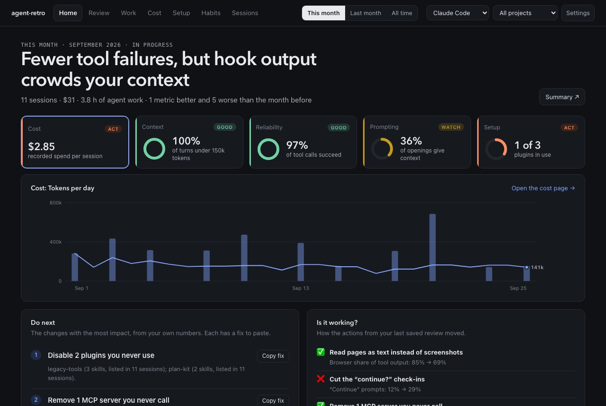
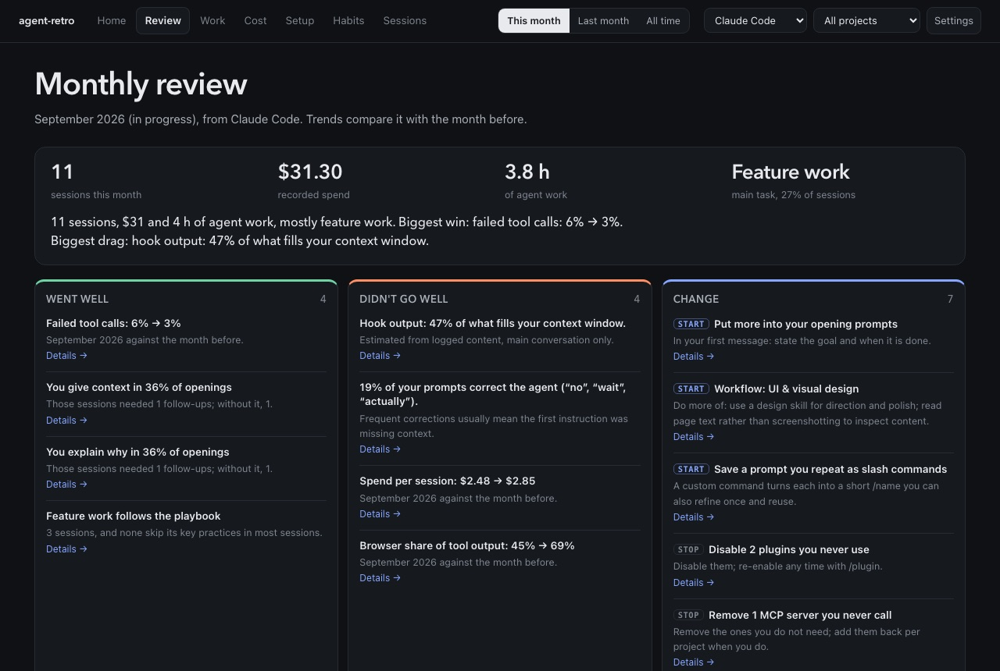
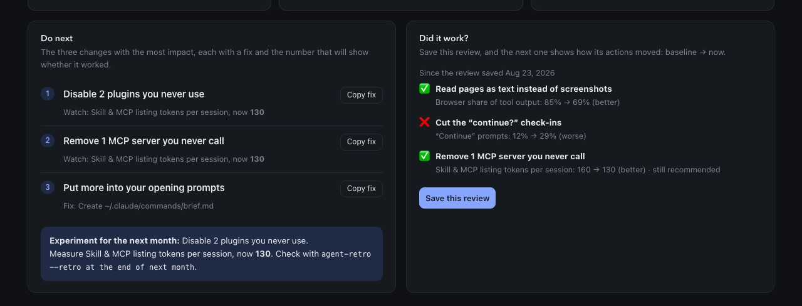
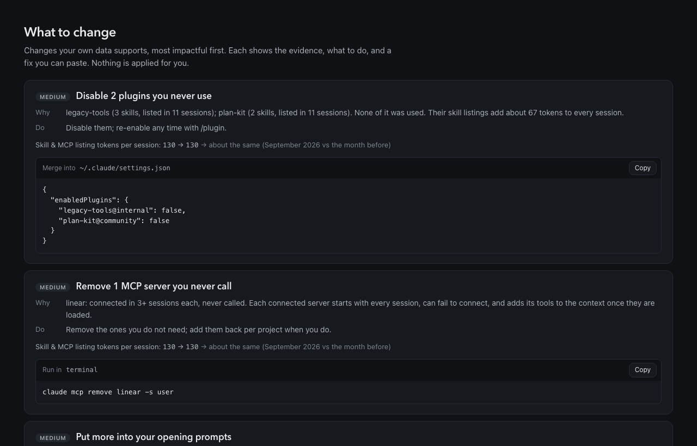
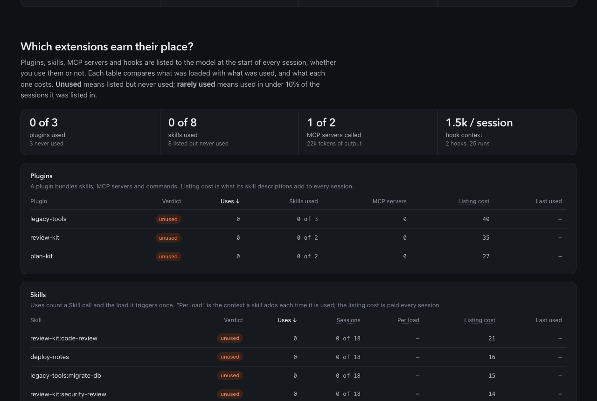

# agent-retro

**Retrospectives for your coding-agent sessions.** agent-retro reads the logs your coding agents
already write to disk: Claude Code, Codex CLI, pi, opencode, Continue, Zed and Cursor. It turns
each session into structured telemetry: what the session was *doing* (code review, debugging, feature
work…), how many turns and tool calls it took, which commands, skills, subagents and MCP servers it
used, what it cost, and where it struggled.

The same telemetry reaches two audiences:

- **You**: a terminal report and a local dashboard with a task table and a session explorer.
- **Your agents**: a versioned, redacted export bundle and an MCP server, so an agent can read how
  you work and suggest better tools, skills, prompts and workflows.

Everything runs locally with zero dependencies (Node >= 18). Nothing is uploaded.

> **Status: 0.1, beta.** The task labels, prompt checks and thresholds were first tuned on one
> person's history. Run `--label-accuracy` after correcting a few labels to see how well the
> rules fit you, and send PRs to the task rules and playbooks.

## Quick start

```bash
npx agent-retro --demo --ui --open    # try it on a month of synthetic sessions
npx agent-retro --ui --open           # your own Claude Code logs, in the browser
npx agent-retro --all-agents          # terminal report over every agent on this machine
```

From a clone: `node agent-retro.mjs …` takes the same flags.
`--demo` never reads your logs. It writes synthetic sessions to a temporary directory, which is
also where the screenshots below come from.







## What you get

### Per-session telemetry

Every session becomes one record. The fields below are from `schema/telemetry.schema.json`.

| Field | What it tells you |
| --- | --- |
| `task.primary`, `task.secondary`, `task.confidence` | What the session was for |
| `turns` | Human prompts, agent turns, "yes/continue" acks, corrections ("no, …"), interrupts |
| `tools` | Calls by name and bucket (shell/edit/read/browser/agent/web), tool **errors**, and shell **command heads** (`gh pr`, `npm test`, `git diff`) |
| `files` | Files edited and read; test-file and doc edits |
| `skills`, `commands`, `mcpServers`, `subagents` | Which extensions actually got used |
| `tokens`, `costUsd`, `peakContext` | Spend and context pressure |
| `context` | **What fills the context window**, estimated by source: system prompt, CLAUDE.md memory, tool and agent listings, skills, hooks, reminders, your prompts, attached files, tool input, tool output (split by tool), reasoning, and replies. Also compactions, turns over 150k, and API errors |
| `subagents.byType` | Per subagent type: runs, tool calls, errors, tokens |
| `risk` | Reads of `.env`, keys or `~/.ssh`; destructive shell commands (`rm -rf` outside build, cache and temp dirs, force-push, hard reset); most tool errors in one turn |
| `signals` | Efficiency inputs: `testRuns`, `fixLoops` (test → edit → test cycles), `toolErrorRate`, `correctionRate`, `ackRate` |
| `text` | Redacted prompt excerpts, depending on `--text` |

Claude Code subagent transcripts (`<session>/subagents/*.jsonl`) are folded into their parent session
as subagent work. They are never counted as your prompts. Each subagent's type comes from the
`agent-*.meta.json` file beside its transcript.

Context sources are **estimates**: about 4 characters per token, main thread only, because
subagents run in their own context window. The logs record exact token totals per turn but not
per source. Subagent usage is reported in tokens rather than dollars, because the logs record cost
per session only. Context, compaction and subagent detail are available for Claude Code today.

### Task labels

Each session is scored offline against a table of task signatures. The signals are prompt wording
(the first prompt counts double), shell commands, skills and slash commands, tool and subagent
names, and edited file types:

`code-review` · `debugging` · `testing` · `feature` · `refactor` · `planning` · `ui-design` ·
`performance` · `docs` · `git-ops` · `deploy-ops` · `research` · `agent-setup` · `other`

The rollup then profiles each task across sessions: count, share, median turns/minutes/tool calls,
cost, tool-error and correction rates, fix loops, and the top tools, commands and skills. That
profile is the input for workflow recommendations. For example: "you do 30 code reviews a month
at a median of 14 turns, mostly by hand with `git diff`".

The rules are the `TASKS` table in `sessions.mjs`, one row per task. See
[CONTRIBUTING.md](CONTRIBUTING.md).

## The monthly review

The review looks back at one period of your agent use, a calendar month by default, compared
with the month before:

- **Period card:** sessions, spend, agent hours, main task, and a one-line verdict ("biggest win,
  biggest drag"). With fewer than 5 sessions it says there are too few to judge, rather than
  drawing conclusions from noise.
- **Went well:** metrics that improved on the month before, prompt practices that work for you,
  clean risk signals.
- **Didn't go well:** the patterns worth acting on, and metrics that got worse.
- **Change:** the recommendations, each tagged *start* (a habit to add) or *stop* (something to
  remove).
- **Do next:** the top three changes, each with a fix to paste and the metric to watch, plus one
  experiment to measure over the next month.
- **Did it work?** **Save this review** (or `--save-retro`), and the next review shows each saved
  action: baseline → now, better or worse.

**Review periods.** Periods are calendar months. The review covers the last **completed** month
and compares it with the one before; `--period <date>` reviews the period containing any date.
If your work runs in fixed cycles instead, give any cycle's first day and its length, under
*Settings* in the dashboard or:

```bash
npx agent-retro --cycle-start 2026-09-16 --cycle-days 14 --save-cycle   # two-week cycles
npx agent-retro --save-cycle                                            # back to calendar months
```

The setting is saved in `~/.agent-retro/config.json`.

**One time period for everything.** The dashboard's *This month / Last month / All time* switch
sets the period for every page, and sessions count in the period they started in. On the command
line, `--scope current|last|all` does the same (all is the default).

To keep it as markdown, in your notes or next to the code:

```bash
npx agent-retro --retro --md
```

Saved reviews live in `~/.agent-retro/retros/`. They hold action ids and metric baselines only,
never prompt text. `get_retro` on the MCP server returns the same review, for "how did my agent use go
last month?" in Claude Code.

## Prompt practices

Each prompt is checked for the visible signs of common prompt-engineering practices:
- context (files, errors, links, screenshots)
- a stated goal and "done when"
- constraints
- the output you want back
- examples (which make a prompt one-shot or few-shot rather than zero-shot)
- structure in long prompts
- the reason behind the request
- role and step-by-step phrasing

On opening prompts, each practice is compared with how those sessions went (follow-up prompts and
corrections), so the advice comes from your own history. For example, "sessions that opened with
context needed 2 follow-ups; without it, 4".

This is pattern-based and needs no LLM. It detects whether a practice is present, not how well it
was done. Judging sufficiency and rewriting prompts would need a model, and is not included.

## Extensions: plugins, skills, MCP servers, hooks

Every plugin, skill and MCP server you install is described to the model at the start of every
session, and every hook's output goes into the context. The Extensions section compares what was
loaded with what was used, one table per kind:

| Kind | Per entity |
| --- | --- |
| Plugins | Verdict, uses, skills used vs listed, MCP servers, listing cost per session, last used |
| Skills | Verdict, uses (a Skill call and the load it triggers count once), sessions used vs listed, **tokens per load**, listing cost, last used |
| MCP servers | Source (user / project / plugin / claude.ai / built-in), verdict, calls, failure rate and top cause, **output tokens returned** |
| Hooks | Runs, p90 duration, failures, **context injected per session** |
| Subagents | Runs, tool calls, failures, tokens |
| Slash commands | Uses, sessions, last used |

The verdicts:
- **Used.**
- **Rarely used:** used in fewer than 10% of the sessions where it was listed.
- **Unused:** listed but never used.

The same data is available through `get_extensions` on the MCP server and as `rollup.extensions` in
the export.

## Time, failures, sequences and trends

- **Time.** Agent working time is the sum of gaps between the agent's consecutive actions, each
  under 30 minutes. Your reply time runs from its last action to your next prompt. Longer gaps count
  as away, so a session resumed days later does not inflate either.
- **Why tools fail.** Each failed call is classified from its error message: wrong arguments or
  order, timeout, command exited with an error, target no longer there, environment (ports, missing
  tools), service unavailable, file permission, file changed since read. A call that never got a
  result counts as *never finished*: the session crashed, was killed or lost it (calls under 10
  minutes old are left alone, since their session may still be running). Calls you declined and
  calls a guard blocked are counted separately and are not failures.
- **How the agent edits.** Reads per edit; edits to a file the agent had not read in that
  conversation (by a read tool or a shell command), which are the ones that break code; files
  patched 5 or more times in one session, a sign the approach is wrong; and full rewrites of a file
  it had read. The main conversation and each subagent are tracked separately.
- **When you stop it.** Your interruptions (Esc) per session, by the last tool the agent ran before
  you stopped it.
- **Repeated command sequences.** Runs of 3–5 shell commands that recur in 3 or more sessions.
  They are candidates for a script or a saved command. Runs that only look around (grep, cat, ls)
  are skipped.
- **Before/after.** Key metrics for the reviewed month against the month before. To measure a specific
  change, use `--split 2026-09-20` (the date you made it). Each recommendation shows the metric it
  aims to move.
- **Correct a label.** Use the dashboard's session panel, or run
  `agent-retro --label <session-id>=<task>`. Corrections are stored in
  `~/.agent-retro/labels.json` and override the rules. `--label-accuracy` shows how often the
  rules agree with you.

## Recommendations

Deterministic rules turn the telemetry into changes you can make, most impactful first. Each rule
fires only when your data clears its threshold. Each recommendation shows the evidence, the action,
and a fix you can paste: a `settings.json` snippet, shell commands, a CLAUDE.md line, or a command
file. Nothing is ever applied for you.

| Rule | Fires when | Fix |
| --- | --- | --- |
| Unused plugins | A plugin's skills are listed in every session but none was used | `enabledPlugins: { "<plugin>@<marketplace>": false }` built from your settings |
| Unused personal skills | A skill in `~/.claude/skills` is listed but never used | `mv` into `~/.claude/skills-parked` (reversible) |
| Unused MCP servers | A connected server is never called | `claude mcp remove <name> -s user` (or `-s local` in the project), or the claude.ai connector setting |
| Screenshots | Browser tools return 30% or more of tool output | CLAUDE.md line: read page text, screenshot only for visuals |
| Context pressure | 30% or more of turns carry more than 150k tokens | `/clear`, `/compact`, delegate searches to subagents |
| Secrets | The agent touched `.env`, keys or `~/.ssh` | `permissions.deny` rules |
| Check-ins | 12% or more of your prompts are "yes" or "continue" | CLAUDE.md line: finish an approved plan without pausing |
| Repeated prompts | A prompt of 15+ characters typed 3 or more times | `~/.claude/commands/<name>.md` |
| Failing tools | A tool or MCP server fails ≥ 8% of 10+ calls | CLAUDE.md line for its most common failure |
| Edits without a read | 10% or more of 20+ edits change a file the agent had not read | CLAUDE.md line: read before editing, re-read after a failed edit |
| Edit loops | In 20% or more of sessions with edits, one file is edited 5+ times | CLAUDE.md line: after a third fix to one file, stop and propose another approach |
| Repeated sequence | A command sequence recurs in 3+ sessions | `~/.claude/commands/<name>.md` running the steps |
| Task playbooks | A task with 3+ sessions skips good practices in more than half of them (e.g. code review without `gh pr diff`, debugging without reproducing first) | `~/.claude/commands/<task>.md`: a workflow for that task, plus suggested tools |
| Heavy hooks | A hook injects 1k+ tokens per session or runs over 1 s at p90 | Trim or scope it |
| Heavy skills | A skill loads 8k+ tokens each time it is used | Split reference material out of SKILL.md |
| Opening prompts | A practice appears in < 30% of openings and your sessions went better with it | `~/.claude/commands/brief.md`, a Goal / Context / Constraints / Output template |
| Read-only allowlist | Read-only commands run 20+ times | `permissions.allow` entries |

The inventory ("what's installed versus what's used") comes from what your logs show was listed to
the model. Only items seen in your last 14 days of sessions count, so plugins you already removed
don't come back. The rules live in `recommend.mjs`, one function each.

## For agents: export and MCP

### Export bundle (the contract)

```bash
npx agent-retro --export ./telemetry --text excerpts --all-agents --days 30
npx agent-retro --sessions --text none | jq 'select(.task.primary == "code-review")'
```

- `telemetry.json`: `{ schemaVersion: 1, generator, generatedAt, textLevel, filters, rollup }`
- `sessions.jsonl`: one session record per line

Both are described by [`schema/telemetry.schema.json`](schema/telemetry.schema.json) (JSON Schema
2020-12). The test suite validates real output against it. Breaking changes bump `schemaVersion`.

### MCP server

```bash
claude mcp add agent-retro -- npx -y agent-retro --mcp --all-agents
# or from a clone:
claude mcp add agent-retro -- node /path/to/agent-retro.mjs --mcp --all-agents
```

| Tool | Returns |
| --- | --- |
| `get_overview` | Volume, per-task profile, tokens, cost, context, top tools, skills and MCP servers |
| `list_sessions` | Session records, filterable by `task` / `agent` / `project` / `days`, sortable by `recent` / `cost` / `turns` / `duration` / `tools` |
| `get_session` | One record by id |
| `get_task_profile` | One task's stats plus the ids of its costliest and longest sessions |
| `get_recommendations` | The recommendations above, with evidence and fixes, for the agent to present to you |
| `get_retro` | The review of one period: card, Went well / Didn't go well / Change, Do next, the experiment and Did it work? |
| `get_extensions` | Plugins, skills, MCP servers, hooks and slash commands, optionally filtered by kind or verdict |

It speaks JSON-RPC 2.0 over stdio with no SDK dependency. It serves exactly the same views as the
export.

### Privacy and text levels

| `--text` | Prompt text in the output |
| --- | --- |
| `none` | None. Numbers, labels and command heads only; titles and example prompts dropped |
| `excerpts` (default) | Session title and the first 3 prompts, 200 chars each |
| `full` | Every human prompt |

At every level, exported strings are redacted before they leave the process:

- API keys and tokens: `sk-…`, `ghp_…`, `github_pat_…`, `AKIA…`, `xox…`, bearer tokens and JWTs
- `key=value` secrets, and long hex or base64 runs
- email addresses
- home-directory paths, which become `~`

Redaction is pattern-based. **Review an export before sharing it.**

## For humans: report and dashboard

```bash
npx agent-retro                     # terminal report
npx agent-retro --md                # markdown
npx agent-retro --json              # full rollup as JSON (unredacted, local use)
npx agent-retro --ui --open         # http://127.0.0.1:4173
```

The dashboard (`ui/index.html`) is self-contained, loads no external assets, listens on localhost
only, and follows your system's light or dark setting. The header has the pages, one time-period
switch (this month, last month, all time) and a Settings menu for the agent, project and review
period.

- **Home** answers three questions on one screen. *How am I doing?* A one-line verdict, then five
  areas (cost, context, reliability, prompting, setup), each marked good, watch or act. Pick an area
  to peek at its chart without leaving Home. *What should I change?* The top three changes, each
  with a fix to copy. *Is it working?* How the actions from your last saved review moved.
- **Review.** The period card, Went well / Didn't go well / Change, Do next and Did it work?,
  then every recommendation with its fix and the metrics compared with the month before.
- **Work.** Tasks with per-session medians (select one to list its sessions, or open its
  playbook), how sessions go, and what the agent does: tools, why they fail, how it edits, when
  you stop it, shell commands and repeated sequences.
- **Cost.** Spend, cache and context size; what fills the context (estimated); tokens per day.
- **Setup.** Plugins, skills, MCP servers, hooks, subagents and slash commands, loaded versus used;
  and risk: secret access, destructive commands, error bursts.
- **Habits.** When you work (activity calendar, weekday × hour punch card) and how you prompt:
  practices in your opening prompts compared with how those sessions went, shot types, and
  openings that could say more.
- **Sessions.** Search, filter and sort every session, with a detail panel where you can correct
  its task label.
- **Summary** turns the review into a short report to read, with a button that copies it as
  markdown.

Every page and section is a link (`#cost`, `#extensions`, …).
A collapsed "More detail" section holds agents compared, models, projects and typed slash commands.
Every section starts with a line explaining what it measures and how to read it. The older topic,
tone and "stage of work" breakdowns were removed: they were tuned to one person's prompts and
duplicated the task labels.

## Supported agents

```bash
npx agent-retro --scan          # discover every agent store on this machine, with sizes
npx agent-retro --all-agents    # merge all parsable agents
npx agent-retro --agent codex   # restrict to one agent
npx agent-retro --doctor        # per-adapter yield; flags STALE / ERROR adapters
```

| Agent | Store | Format |
| --- | --- | --- |
| Claude Code | `~/.claude/projects` (+ subagents, optional `~/.claude/transcripts`) | JSONL |
| pi | `~/.pi/agent/sessions` | JSONL |
| Codex CLI | `~/.codex/sessions` | JSONL rollout |
| opencode | `~/.local/share/opencode/storage` | JSON graph |
| Continue | `~/.continue/sessions` | JSON |
| Zed | `~/Library/Application Support/Zed/threads` | SQLite + zstd (needs `sqlite3`) |
| Cursor | `~/Library/Application Support/Cursor/.../state.vscdb` | SQLite KV (needs `sqlite3`) |

Antigravity/Gemini, Windsurf, Copilot, Amp and Factory stores are discovered by `--scan` but not
parsed yet. Tool detail (commands, file paths) and tool errors are richest for Claude Code, and
partial for the other agents.

### Platform support

| | Status |
| --- | --- |
| Claude Code | Verified against real logs: the richest data (context, extensions, errors, time) |
| Codex CLI, pi, opencode, Continue | Verified against real-shaped test fixtures |
| Zed, Cursor | Parsed with the `sqlite3` CLI; the store paths are macOS-only for now |
| macOS, Linux | Supported (CI runs on Linux with Node 18, 20 and 22) |
| Windows | Untested; path redaction and `--open` handle Windows, but no CI yet |

### Adapter resilience

Vendor formats change without notice. There are four layers of defense:

1. **Shape-based fallback:** `collectGeneric` re-parses records by field *shape* when a precise
   adapter yields nothing.
2. **Health reporting:** `--doctor` flags adapters that find files but produce zero events.
3. **Fixture tests:** `npm test` runs every adapter against small real-shaped fixtures.
4. **One event model:** each adapter emits normalized events (see the top of `agents.mjs`), so
   adding an agent never touches the analysis.

## All flags

```
--all-agents | --agent <id>   which agents to read (default: Claude Code)
--days <n>  --project <substr>  --tz <hours>  --top <n>
--dir <path>                   override the Claude log root (repeatable)
--include-transcripts          also read ~/.claude/transcripts
--all-sources                  include SDK/system-injected prompts
--no-history                   skip ~/.claude/history.jsonl
--json | --md                  report format
--ui [--port n] [--open]       dashboard
--export <dir>  --sessions  --text none|excerpts|full   agent-facing telemetry
--mcp                          MCP server on stdio
--split <date>                 before/after comparison around a date
--label <id>=<task>            correct a session's task (--label <id>= clears it)
--label-accuracy               how often the rules agree with your corrections
--demo                         synthetic data instead of your logs
--retro [--md]  --save-retro   print only the retro (paste-ready with --md); save it for the next review
--period <date>                review the period (month) containing <date>
--scope current|last|all       limit the whole analysis to one period
--cycle-start <date> --cycle-days <n> --save-cycle   review in fixed cycles instead of months
--scan  --list-agents  --doctor  --errors
```

## Roadmap

1. **Telemetry** (this release): sessions, task labels, rollup, export, MCP, dashboard.
2. **Recommendations** (rule-based, this release), with before/after tracking, failure causes,
   time accounting and repeated-sequence mining.
3. **Generators:** write the recommended `SKILL.md`, slash commands and hooks for you to install.

## Development

```bash
npm test                         # node --test tests.mjs (fixtures, schema, CLI, MCP)
```

Original design notes (telemetry core; later features are described in this README):
[`docs/specs/2026-09-26-session-telemetry-design.md`](docs/specs/2026-09-26-session-telemetry-design.md).
See also [CHANGELOG.md](CHANGELOG.md) and [SECURITY.md](SECURITY.md).
MIT licensed.
